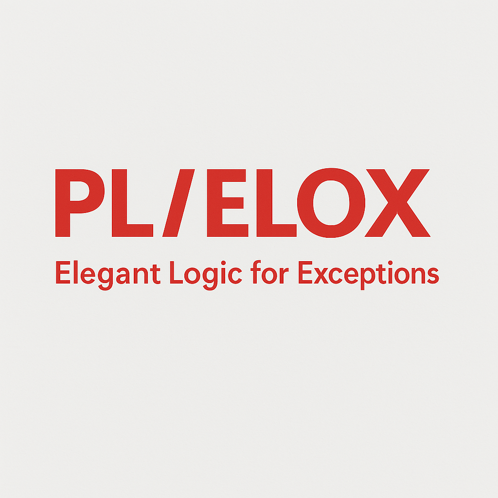

# PL/ELOX – Elegant LOgic for eXceptions



> ```plsql
> exception
>   when PL/SQL
>   then PL/ELOX
> ```

**PL/ELOX** stands for **Elegant LOgic for eXceptions** and aims to provide a clean, structured approach to exception handling in **PL/SQL**. The goal is to support modular, layered Oracle-based applications with a consistent and expressive error-handling strategy.

---

## 🚧 Current Status

This repository is under active construction. Initial concepts and patterns are being developed and iterated. Contributions and feedback are very welcome.

---

## 🎯 Vision & Goals

PL/ELOX is designed to:
- Provide a central reference for **Oracle-defined and undefined SQL errors**
- Make non-named exceptions accessible and reusable via named constants
- Offer a **layer-friendly, modular approach** to exception handling
- Include **helpers for collecting errors**, classification, and propagation of exceptions
- Be **extensible and easy to integrate** into existing PL/SQL projects without requiring deep architectural changes

---

## 📦 Planned Components

| Module           | Description |
|------------------|-------------|
| `error_collector` | Collects multiple exceptions during runtime, supports aggregation and finalization |
| `elox_exceptions` | Contains redefined Oracle exceptions and maps common SQLCODEs to named exceptions using `PRAGMA EXCEPTION_INIT` |
| `elox_factory` | Creates standardized exception instances and prepares structured responses |
| `elox_types` | Defines shared object types and collections for exception transport and encapsulation |

---

## 📂 Repository Layout

- `src/` – Source code for PL/ELOX modules
- `examples/` – Real-world usage samples (in progress)
- `docs/` – Architecture and design documentation
- `assets/` – Branding and visual assets like logos
- `README.md` – You're here!

---

## 🧪 Roadmap

- [X] Define core exception constants in `elox_exceptions`
- [X] Create standard `error` object and collection types
- [X] Create a helper to collect, classify and handle collected errors
- [ ] Harden implementations
- [ ] Resolve open ToDos
- [ ] Create working examples for different use cases
- [ ] Publish first working example use case
- [ ] Add documentation and usage guidelines

---

## 📫 Feedback & Contact

Want to contribute or share ideas?  
Feel free to open an issue or reach out directly.

---

## 📝 License

This project is licensed under the MIT License.
You are free to use, modify, and distribute this software in personal or commercial projects, provided that proper credit is given.

---

**Author:** Andreas Kay Elbert
